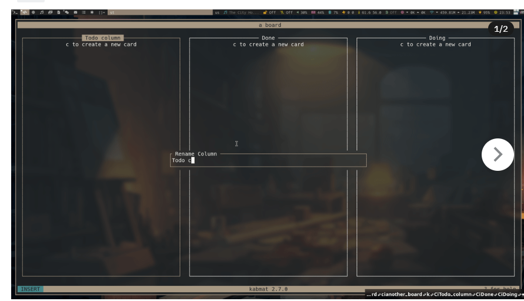
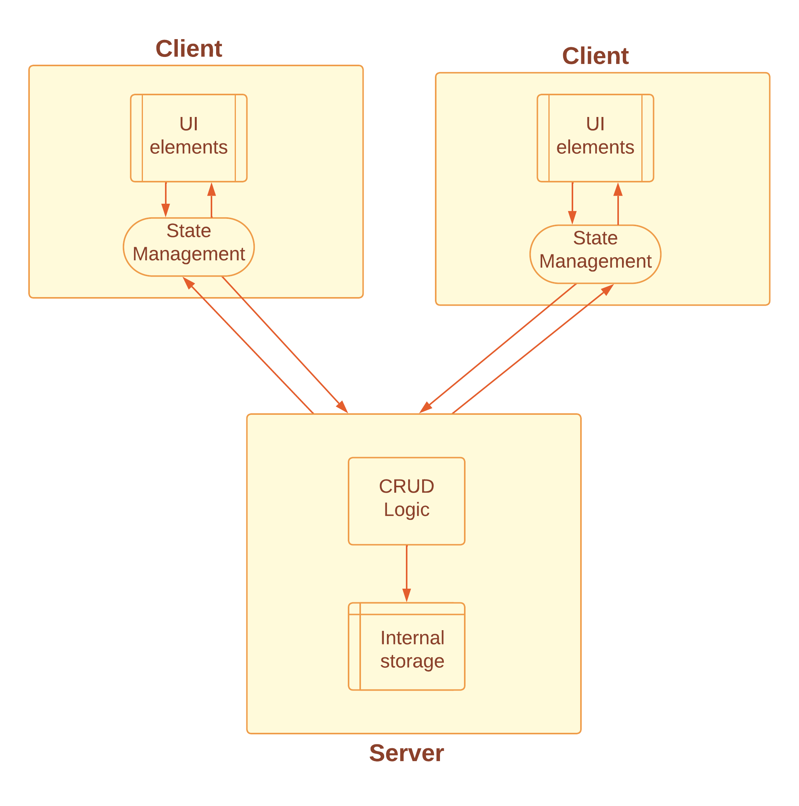

# Hask-Task
Final project for the course CSE 230 Fall 2023
## Team members:
1. Shril Mody
2. Viraj Shah
3. Siddhant Jadhav

## Project Proposal: Networked Task/Todo Board like Scrum/Kanban board
### Introduction:
Hask-Task is a Networked Task/Tod Board project that aims to develop a simple yet functional terminal-based task management system like Scrum using Haskell and the Brick library. This project will provide users with a straightforward interface to collaborate and manage tasks effectively, allowing for task creation, categorization, prioritization, and status tracking among teammates.

### Purpose:
The purpose of this project is to offer a basic task management solution within a terminal environment. The Task/Todo Board intends to enable users to organize tasks, mark them as completed, and visualize their tasks using a board-like interface. This tool, designed for both students and professionals, offers a clear and intuitive interface to add, categorize, and visualize tasks, fostering productivity and effective time management in daily activities.

### Features:
1. Task Display
2. Task Modification
3. Status Updates
4. Collaboration between teammates over network
5. Basic Navigation through tasks

### Timeline:
Week 1: Setup, initial UI design, and basic task structure implementation.  

Week 2-3: Task management functionalities, category handling, and status updates.  

Week 4: UI refinement, testing, and documentation.

### Here is an Example of our Kanban board.

## Milestone 2: Updates
### What is the architecture of your application (the key components)?
Our project supports collaboration over network. Hence, we have two main parts of the system - client and server.

#### Client Architecture:
1. UI Elements (Using Brick):
   - Views and Widgets: Utilizes Brick library for constructing UI elements like task displays, menus, and interactive components for users to view and manipulate tasks.

2. State Management of UI:
   - UI State Handling: Manages the state of the UI components, including user interactions, screen transitions, and data rendering.
   - Interaction Handlers: Captures user input events and triggers appropriate actions within the UI.

#### Server Architecture:
1. Schema Modules:
   - Task Schema: Defines the structure of tasks, including attributes like title, description, status, etc.
   - User Profile Schema (if applicable): Defines user-related information for authentication or permissions.

2. CRUD Logic:
   - Task Operations: Contains logic for creating, reading, updating, and deleting tasks.

4. Storage:
   - Database or File Storage: Handles the storage of task data. It interacts with the CRUD logic to store and retrieve task-related information. For simplicity, this would be an in-memory database that will not be persistent upon restart of the server.

### What challenges (if any) did you have so far and how did you solve them?
1. Installation and Setup Challenges:
Difficulty in installing and configuring the application across multiple devices. Setup issues encountered while dealing with different environments or platforms.
Currently, we are using `ghci` and `stack` to run the project.

2. Networking Library Exploration:
Searching for suitable networking libraries compatible with Haskell for implementing network functionalities. Learning about different networking libraries and their usage within the context of the project.

3. Learning Curve for Brick Library:
Initial challenges in understanding and learning to use the Brick library for building terminal-based user interfaces.

In addition, we expect the following challenges during implementation.

1. UI Design Complexity: Designing an effective terminal-based UI using Brick might present challenges in layout, navigation, and user interaction. To tackle this, breaking down UI components into smaller, manageable units can help streamline the design process.

2. Networking Implementation: Implementing networking for real-time collaboration can be complex. Ensuring seamless communication between clients and the server while handling potential network issues requires careful planning.

3. State Management: Handling the state within the application, especially in a multi-user environment, can lead to complexities in maintaining consistency.

4. Error Handling and Validation: Dealing with edge cases, error scenarios, and input validation is crucial for a robust application. Implementing comprehensive error-handling mechanisms and validating user inputs is extremely necessary for the application.

5. Concurrency: Since it is a networked system, multiple users can try to access the database. This can lead to concurrency issues. To tackle this, using concepts like immutable data structures, software transactional memory (STM), and explicit handling of side effects would be important.

### Do you expect to meet your goals until the deadline? If not, how will you modify your goals?
We might not complete the advanced features related to managing multiple tasks simultaneously (concurrency) and establishing connections between different devices or users (networking) within the planned project timeline. These aspects might need more time than initially expected to implement thoroughly. Instead, we'll focus on completing the essential and core functionalities of the project to ensure a functional and usable system within the given timeframe. The advanced features might be considered for future updates or iterations once the primary functionalities are in place.
